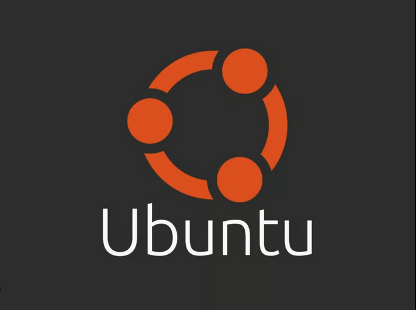

# Ubuntu Dual SSD Install Guide



Installing Ubuntu alongside Windows on the same drive often leads to GRUB overwriting Windows Boot Manager, EFI mix-ups, and partition conflicts.  
This repository demonstrates a safe, beginner-friendly, and best-practice approach:  
**Installing Ubuntu on an entirely separate SSD**.

By isolating both systems physically, we preserve clean bootloaders, avoid destructive errors, and ensure long-term maintainability.  
If you need help cloning a drive before beginning, refer to the complementary repository:  
[Clonezilla SSD Clone Guide](https://github.com/luisgrm/clonezilla-ssd-clone-guide)

---

## Project Scope & Goals

This repository focuses only on:

- Installing **Ubuntu on a second SSD** without touching Windows
- Creating a Live USB using **Rufus**
- Disconnecting the Windows SSD prior to installation (integrated inside doc 03)
- Running through the Ubuntu installation step-by-step
- Post-install setup, drivers, updates, and boot order configuration
- Configuring BIOS boot order

Out of Scope:

- Clonezilla/drive cloning
- Installing Ubuntu on shared partitions
- Virtual machine installation
- Windows removal, partition wiping, or GRUB recovery techniques

---

## Repository Structure

```plaintext
ubuntu-dual-ssd-install/
|
│── README.md
│── documents/
│   ├── 01-overview.md
│   ├── 02-create-live-usb.md
│   ├── 03-ubuntu-install.md       # (includes physical SSD prep section)
│   └── 04-post-install-config.md
│── images/
│   ├── overview/
│   ├── create-live-usb/
│   ├── ubuntu-install/
│   └── post-install-config/
└── LICENSE
```

---

## Documentation Index

### 01 — Overview  
Understanding dual-SSD installation, why it’s safer, and how it avoids EFI/bootloader issues.  
Explains risks of shared-disk dual boot setups & benefits of OS isolation.  
[documents/01-overview.md](documents/01-overview.md)

### 02 — Create Live USB (Rufus)  
Download Ubuntu ISO → verify checksum → create USB with proper settings.  
Includes Secure Boot considerations, file system type, and USB boot readiness tests.  
[documents/02-create-live-usb.md](documents/02-create-live-usb.md)

### 03 — Ubuntu Install Walkthrough  
Physical SSD preparation (disconnect Windows drive), BIOS boot entry selection, installer flow, partitioning, desktop setup.  
[documents/03-ubuntu-install.md](documents/03-ubuntu-install.md)

### 04 — Post-Install Configuration  
Updating packages, drivers, enabling restricted codecs, restoring both SSDs, configuring UEFI boot priority & GRUB.  
Includes troubleshooting notes for Wi-Fi firmware, bootloader order, and common new-user issues.  
[documents/04-post-install-config.md](documents/04-post-install-config.md)

---

## Why Dual-SSD Installation is Best Practice

Running Windows + Ubuntu on the same NVMe can work, but it’s risky.   
Dual-SSD eliminates almost all common dual boot conflicts:

- GRUB replacing Windows Boot Manager  
- EFI partition corruption  
- Accidentally formatting the wrong drive during install  
- Windows updates overriding Ubuntu EFI entries  
- File system compatibility issues  
- Slower drives due to mixed OS partitions  

**Each SSD maintains its own boot environment, keeping both operating systems isolated and stable.**

---

## Requirements

| Requirement | Description |
|------------|-------------|
| USB Drive (8GB+) | Used to flash Ubuntu ISO using Rufus |
| Ubuntu ISO | Preferably an LTS release for stability |
| Second SSD | Dedicated drive for Linux installation |
| UEFI-Capable PC | Secure boot may require toggling |
| Basic BIOS Knowledge | Boot device selection + drive order adjustments |
| Physical Access to SSDs | Required to temporarily disconnect and reconnect drives safely |

---

## License

This project uses the **[MIT License](./LICENSE)**.  
You may modify, use, or redistribute this documentation freely.

---

## Credits

This repository is a personal educational and documentation project and is **not official Ubuntu or Canonical documentation**.

- *Ubuntu* is a trademark of **Canonical Ltd.**
- All referenced technologies belong to their respective owners  
- Documentation, research, structure & writing by **Luis Morin**